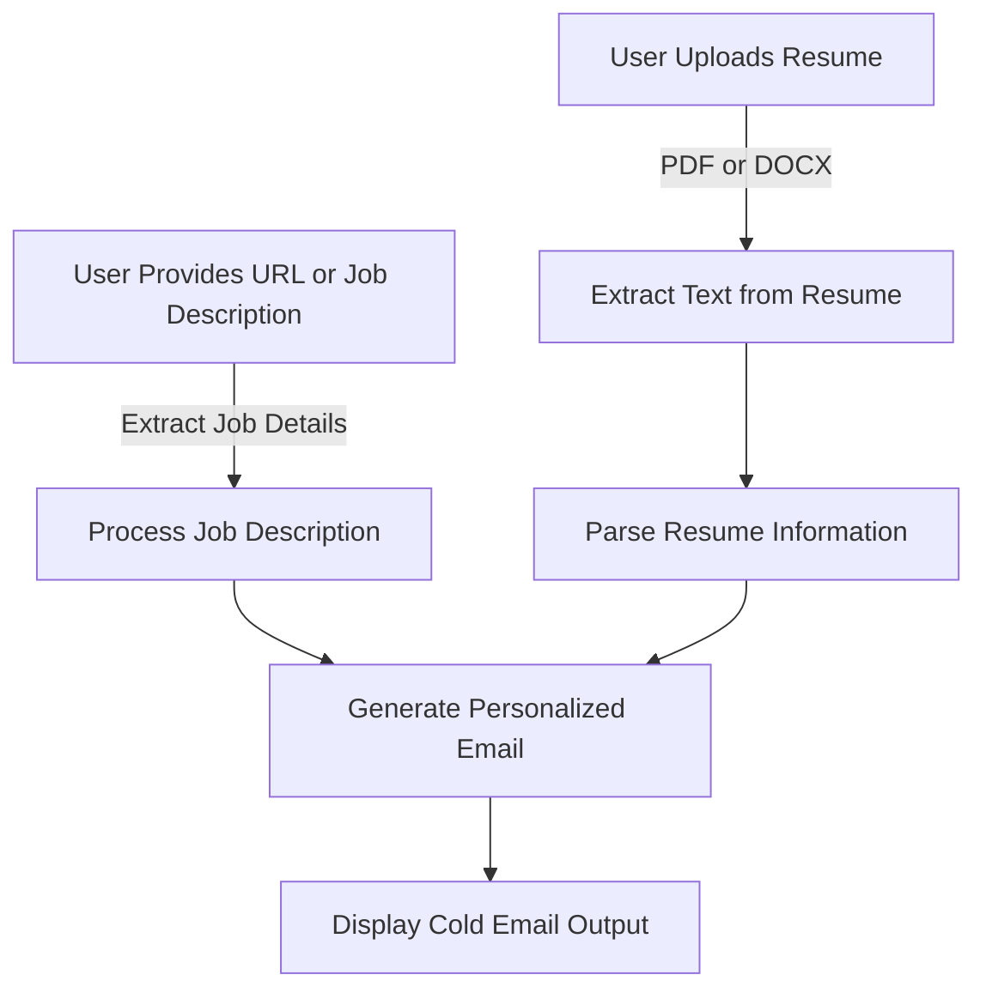

# Cold Email Generator

A **Cold Email Generator** powered by **Streamlit, LangChain, and Groq API** to help job seekers craft professional and personalized emails for recruiters using their resumes and job descriptions.

## Features
- 📄 Upload a **PDF or DOCX** resume.
- 🔍 Extract job descriptions from a **URL** or manually input a description.
- 📝 Automatically analyze resume details like **name, skills, experience, projects, etc.**
- 🤖 Generate a **polished cold email** tailored to the job description.

## Technologies Used
- **Streamlit** (Frontend UI)
- **LangChain** (LLM-powered text generation)
- **Groq API** (LLM Model: `gemma-2b-it`)
- **PyMuPDF** (PDF text extraction)
- **python-docx** (DOCX text extraction)
- **WebBaseLoader** (Job Description extraction from URLs)

## Installation
### Prerequisites
Ensure you have **Python 3.8+** installed. Then, install the dependencies:

```sh
pip install streamlit langchain langchain_groq langchain_community pymupdf python-docx
```

### Set Up API Key
Create a `.env` file and add:

```sh
GROQ_API_KEY=your_api_key_here
```

## Usage
Run the Streamlit app:

```sh
streamlit run app.py
```

## Workflow Diagram


## Future Enhancements
- ✅ Add support for additional file formats.
- ✅ Improve job description extraction using advanced NLP techniques.
- ✅ Provide multiple email format options (casual, formal, concise).

---

### Contributions
Feel free to reach out. Issues and suggestions are welcome!

